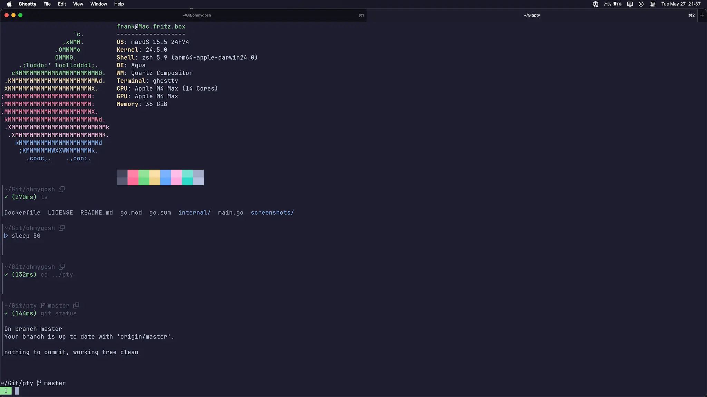

# Oh My Gosh

Interactive shell written in Go with a UI inspired by [Warp](https://www.warp.dev).

What's different from Warp? It's a shell, not a terminal.
That means you can use a terminal that is actually good while enjoying high level shell features.

> [!WARNING]
> This is a work in progress and experimental.
> Not ready for production use.

> [!NOTE]
> Windows is currently not supported.
> There are some issues with PTY not being a thing on Windows.
> That's a limitation of the Windows operating system.
> If you have a solution for this, please reach out to me.

- Run multiple commands at once
- Connect to a running command to enable stdin input
- Cancel running commands via a mouse click
- Copy output via a mouse click
- Vim motions in command prompt



## Installation

### [Homebrew](https://brew.sh) (macOS & Linux)

```shell
brew tap tsukinoko-kun/tap
brew install tsukinoko-kun/tap/ohmygosh
```

### Go

```shell
go install github.com/tsukinoko-kun/ohmygosh@latest
```

### Docker

https://github.com/tsukinoko-kun/ohmygosh/pkgs/container/ohmygosh

```shell
docker pull ghcr.io/tsukinoko-kun/ohmygosh:latest
```

